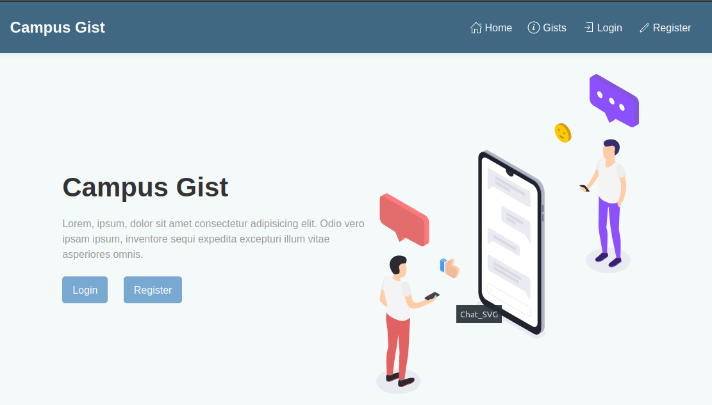

# Campus Gist

[](https://github.com/tterb/atomic-design-ui/blob/master/LICENSEs)

A web app for students, to post gist about anything happening in their institutions, and chat with others.

## Tech Stack (MENS)

- **Client:**

  - HTML5
  - CSS3
  - TailwindCSS
  - SvelteKit

- **Server:**

  - Node (Express.js)

- **Database:**

  - MongoDB

## Features

- Create Post with Rich Text Editor
- Update, Delete and Edit Gists
- Separate Chat Room

## Run Locally

### Requirements to have

- Node v16+ (recommended)
- Git

Clone the project

```bash
  git clone https://github.com/benjithorpe/campus-gist.git
```

Go to the project directory

```bash
  cd campus-gist
```

Install the dependencies

```bash
  npm install
```

Start the dev server

```bash
  npm run dev
```

## Screenshots


